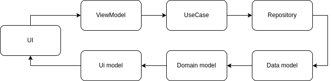

# Отзывы на карте
Проектная работа курса "Разработка прикладного ПО на Qt и ОС «Аврора»" на тему "Отзывы на карте".

Оглавление
* [Демо](#демо)
* [Структура проекта](#структура-проекта)
* [Архитектура](#архитектура)
* [Поток данных](#поток-данных)

## Демо

  

## Структура проекта
* data - слой источника данных
  * datasource - сами источники данных, где приложение получает необработанные данные.
  * model модель  - источника данных
  * repositoryImpl - реализация интерфейса/контракта репозитория безнес логики.
* domain - слой бизнес логики
  * usecase - пользовательские сценарии
  * model - бизнес модель
  * repository - интерфейс/контракт, с которым работают пользовательские сценарии
* presentation - слой представления
  * handlers - обработчики нажатия на стороне UI.
  * model - модель представления, на изменение которой подписывается UI
  * ViewModel - связующее звено между бизнес логикой и UI
* dependencyProvider - провайдер зависимостей для скрытия деталей инициализации.
* stringProvider - провайдер строковых значений для использовании в бизнес логике.

## Архитектура

Проект придерживается чистой архитектуры.

  

Слой бизнес логики:
* В центре находится пользовательские сценарии(usecase). Пользовательские сценарии взаимодействуют
интерфейсом репозитория. 
* Интерфейс открывает возможность менять модель бизнес логики.

Слой источника данных:
* Реализация интерфейса репозитория взаимодействует с источниками данных.
* Источники данных меняют модель текущего слоя.
* При изменении модели источника данных происходит маппинг данных и изменение бизнес модели.

Слой представления:
* В центре модель представления(viewmodel), которая взаимодействует с пользовательскими сценариями. 
* Модель представления подписывается на изменение бизнес модели с последующим маппингом данных.
* При изменении модели представления, происходит обновление данных на стороне UI посредством стандартного механизма MVC.
* Отношение UI и MainViewModel представленно в виде шаблона MVVM.

## Поток данных

  

